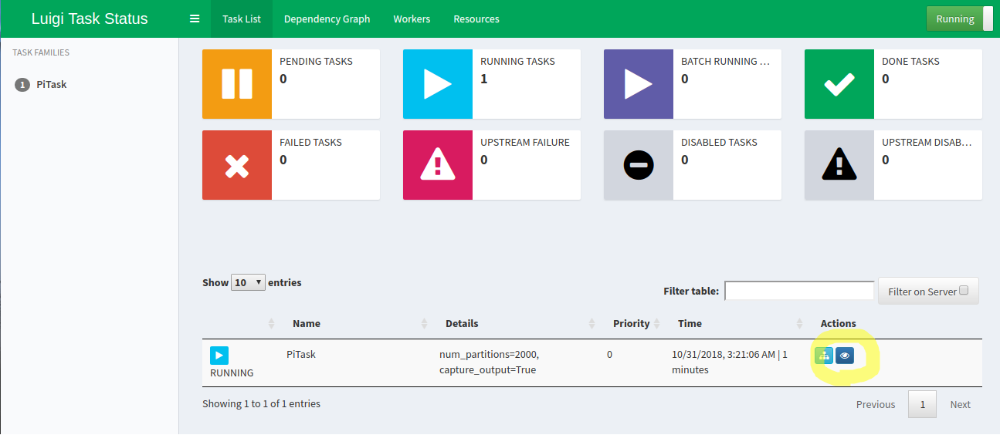

# Luigi with Spark

This repository holds my own example of how to make Luigi show up 
Spark tracking URL in its' web UI.  
In my opinion it makes Luigi UI a bit more useful.

The main idea: get output logs and parse them until we find the tracking URL.
The downside of the approach is that we reject logs coming after we've realized the URL.
On the other hand, why not to go to cluster UI? ;)

Here is where we expect to appear in luigi web ui:

Personally I find it very useful!

### How to run example

Run `run-example.sh` with started `luigid` process, 
view the result on `localhost:8082`.

## Built With
* [Pipenv](https://github.com/pypa/pipenv) -- Python Development Workflow for Humans
